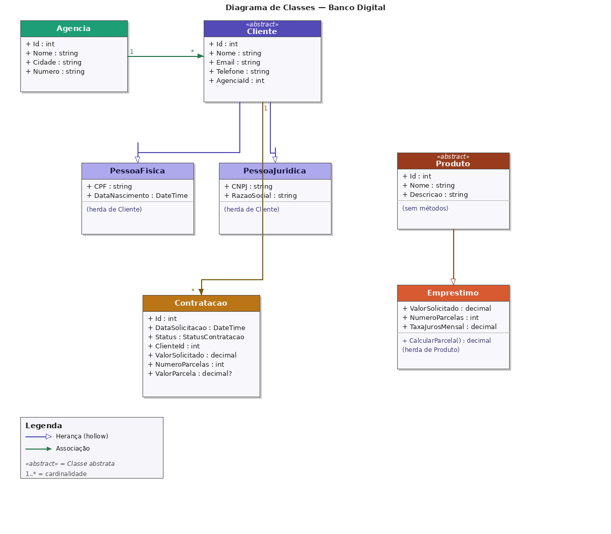

# Banco Digital API

## 1. Identificação

| Nome | RM |
|------|----|
| SEU NOME AQUI | RM000000 |

---

## 2. Produto Bancário Escolhido

**Empréstimo**

Escolhemos o produto **Empréstimo** por ter uma regra de negócio clara e bem definida: o cálculo do valor da parcela usando a fórmula de **juros compostos (Price)**:

```
PMT = PV * i / (1 - (1+i)^-n)
```

Onde:
- `PV` = valor solicitado
- `i` = taxa de juros mensal
- `n` = número de parcelas

---

## 4. Diagrama de Classes



---

## 6. Endpoints Disponíveis

### POST /api/agencias — Cadastrar Agência
**Request:**
```json
{
  "nome": "Agência Centro",
  "cidade": "São Paulo",
  "numero": "0001"
}
```
**Response 201:**
```json
{
  "id": 1,
  "nome": "Agência Centro",
  "cidade": "São Paulo",
  "numero": "0001"
}
```

---

### GET /api/agencias/{id} — Buscar Agência
**Response 200:**
```json
{
  "id": 1,
  "nome": "Agência Centro",
  "cidade": "São Paulo",
  "numero": "0001"
}
```
**Response 404:**
```json
{ "mensagem": "Agência não encontrada." }
```

---

### POST /api/clientes/pf — Cadastrar Pessoa Física
**Request:**
```json
{
  "nome": "João Silva",
  "email": "joao@email.com",
  "telefone": "11999999999",
  "cpf": "12345678900",
  "dataNascimento": "1990-05-15",
  "agenciaId": 1
}
```
**Response 201:**
```json
{
  "id": 1,
  "nome": "João Silva",
  "email": "joao@email.com",
  "tipo": "PF",
  "agenciaId": 1,
  "cpf": "12345678900"
}
```
**Response 400 (CPF duplicado):**
```json
{ "mensagem": "CPF já cadastrado." }
```
**Response 404 (agência não existe):**
```json
{ "mensagem": "Agência não encontrada." }
```

---

### POST /api/clientes/pj — Cadastrar Pessoa Jurídica
**Request:**
```json
{
  "nome": "Empresa XYZ",
  "email": "contato@xyz.com",
  "telefone": "1133334444",
  "cnpj": "12345678000190",
  "razaoSocial": "Empresa XYZ Ltda",
  "agenciaId": 1
}
```
**Response 201:**
```json
{
  "id": 2,
  "nome": "Empresa XYZ",
  "email": "contato@xyz.com",
  "tipo": "PJ",
  "agenciaId": 1,
  "cnpj": "12345678000190",
  "razaoSocial": "Empresa XYZ Ltda"
}
```

---

### GET /api/clientes/{id} — Buscar Cliente
**Response 200:**
```json
{
  "id": 1,
  "nome": "João Silva",
  "email": "joao@email.com",
  "tipo": "PF",
  "agenciaId": 1,
  "cpf": "12345678900"
}
```

---

### POST /api/contratacoes — Solicitar Contratação de Empréstimo
**Request:**
```json
{
  "clienteId": 1,
  "valorSolicitado": 10000.00,
  "numeroParcelas": 12,
  "taxaJuros": 0.02
}
```
**Response 201:**
```json
{
  "id": 1,
  "clienteId": 1,
  "status": "Aprovado",
  "valorSolicitado": 10000.00,
  "numeroParcelas": 12,
  "valorParcela": 948.79,
  "dataSolicitacao": "2026-05-05T10:30:00"
}
```
**Response 404 (cliente não existe):**
```json
{ "mensagem": "Cliente não encontrado." }
```

---

### GET /api/contratacoes/{id} — Consultar Status da Contratação
**Response 200:**
```json
{
  "id": 1,
  "clienteId": 1,
  "status": "Aprovado",
  "valorSolicitado": 10000.00,
  "numeroParcelas": 12,
  "valorParcela": 948.79,
  "dataSolicitacao": "2026-05-05T10:30:00"
}
```

---

## Como Executar

### 1. Configure a connection string no `appsettings.json`
```json
{
  "ConnectionStrings": {
    "Oracle": "User Id=SEU_RM;Password=SEU_RM;Data Source=oracle.fiap.com.br:1521/ORCL;"
  }
}
```

### 2. Rode as migrations para criar as tabelas no Oracle
```bash
dotnet ef migrations add Inicial
dotnet ef database update
```

### 3. Rode a aplicação
```bash
dotnet run
```

### 4. Acesse o Swagger
```
https://localhost:5001/swagger
```
